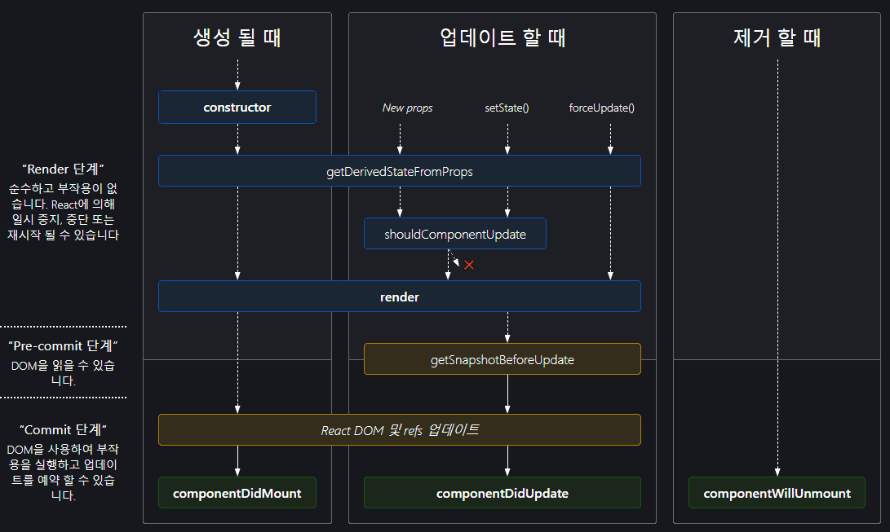

vanilla / React life cycle

리액트 -> 컴포넌트 기반의 View를 중심으로 한 라이브러리이다. 그래서 각각의 컴포넌트에 라이프 사이클( 컴포넌트의 수명 주기가 존재함 ) 

**컴포넌트의 수명은 보통 페이지에서 렌더링 되기 전인 준비 과정에서 시작해서 페이지에서 사라질 때 끝이 난다.




라이프 사이클은 총 9개가 존재하고 세가지 유형으로 나눌 수 있음.

마운트 / 업데이트 / 언마운트

업데이트 
1. props가 바뀔 때
2. state가 바뀔 때
3. 부모 컴포넌트가 바뀔 때
4. 강제로 렌더링을 트리거할 때(this.forceUpdate == useEffect(?))


(1) constructor(생성자) 컴포넌트를 만들 때 처음으로 실행 됨


 ```javascript
// Class
class Example extends React.Component {
    constructor(props) {
        super(props);
        this.state = { count: 0 };
}

// Hooks
const Example = () => {
    const [count,setCount] = useState(0);
}

 ```

 클래스형 -> 초기 state를 정할 때 constructor를 사용 
  
  함수형(훅) ->  useState로 초기 상태 전달


(2) getDerivedStateFromProps

props로 받아 온 값을 state에 동기화시키는 용도로 사용하며, 컴포넌트가 마운트될 때와 업데이트 될 때 호출된다.


```javascript
// Class
class Example extends React.Component {
    constructor(props) {
        super(props);
        this.state = { count: 0 };
}

// Hooks
const Example = () => {
    const [count,setCount] = useState(0);
}
```

(3) shouldComponentUpdate

props나 state를 변경했을 때, 리렌더링을 할지 말지 결정하는 메서드이다. 이 메서드에서는 반드시 true나 false를 반환해야한다. 이 메서드는 오직 성능 최적화만을 위한 것이며 렌더링 목적을 방지하는 목적으로 사용하게된다면 버그로 이어질 수 있다.

```javascript
// Class
class Example extends React.Component {
  shouldComponentUpdate(nextProps) {
    return nextProps.value !== this.props.value
  }
}

// Hooks
const Example = React.memo(() => {
      ...
  },
  (prevProps, nextProps) => {
    return nextProps.value === prevProps.value
  }
)

```

(4) render

함수형 프로그래밍에서는 안쓰이지만 제일 중요한 메서드.
컴포넌트를 렌더링할 때 필요한 메서드임
```javascript
// Class
class Example extends React.Component {
  render() {
    return <div>컴포넌트</div>
  }
}

// Hooks
const example = () => {
  return <div>컴포넌트</div>
}

```


(5) getSnapshotBeforeUpdate

render에서 만들어진 결과가 브라우저에 실제로 반영되기 직전에 호출된다.

<!-- ?? -->
ex) 채팅 화면처럼 스크롤 위치를 따로 처리하는 작업이 필요한 UI 등을 생각해볼 수 있음

```javascript
class Example extends React.Component {
  getSnapshotBeforeUpdate(prevProps, prevState) {
    if (prevProps.list.length < this.props.list.length) {
      const list = this.listRef.current
      return list.scrollHeight - list.scrollTop
    }
    return null
  }
}
```

(6) componentDidMount

이 메서드는 컴포넌트를 만들고 첫 렌더링을 마친 후 실행한다. 함수형 Hooks 에서는 useEffect를 활용하여 다음의 기능을 구현할 수 있다.

```javascript
// Class
class Example extends React.Component {
    componentDidMount() {
        ...
    }
}

// Hooks
const Example = () => {
    useEffect(() => {
        ...
    }, []);
}

```

** 여기서 useEffect의 [] 의존성 배열을 비워야지만 똑같은 메소드를 구현할 수 있다.

(7) ComponentDidUpdate

리렌더링을 완료한 후 실행 업데이트가 끝난 직후라서 Dom관련 처리 가능(??)
```javascript
// Class
class Example extends React.Component {
    componentDidUpdate(prevProps, prevState) {
        ...
    }
}

// Hooks
const Example = () => {
    useEffect(() => {
        ...
    });
}

```

(8) componentWillUnmount

컴포넌트를 DOM에서 제거할 때 실행한다. componentDidMount에서 등록한 이벤트가 있다면 여기서 제거 작업을 해야한다. 함수형 컴포넌트에서는 useEffect CleanUp 함수를 통해 해당 메서드를 구현할 수 있다.


```javascript
// Class
class Example extends React.Component {
    coomponentWillUnmount() {
        ...
    }
}

// Hooks
const Example = () => {
    useEffect(() => {
        return () => {
            ...
        }
    }, []);
}
```

(9) componentDidCatch

 맨 위의 사진에는 보이지 않지만 componentDidCatch라는 메서드가 존재한다. 이 메서드는 컴포넌트 렌더링 도중에 에러가 발생 했을 때 애플리케이션이 멈추지 않고 오류 UI를 보여줄 수 있게 해준다.

```javascript
// Class
class Example extends React.Component {
  componentDidCatch(error, info) {
    console.log('에러가 발생했습니다.')
  }
}

```

---HTML life cycle---

DOMContentLoaded
load
beforeunload / unload 


DOMContentLoaded

onload 이벤트보다 먼저 발생합니다. 즉, DOM tree가 완성되면 바로 발생하므로 빠른 실행 속도가 필요할 때 적합합니다. 다음은 DOMContentLoaded를 이벤트를 다루는 방법들입니다.

```javascript
window.addEventListener('DOMContentLoaded', function(){ 
    //실행될 코드 
 });

//jQuery
$(document).ready(function(){ 
    //실행될 코드 
});

```

load

문서의 모든 콘텐츠가 로드된 후 발생하는 이벤트입니다. 이로 인해 불필요한 로딩 시간이 추가될 수 있습니다. 동일한 문서에는 오직 onload는 하나만 존재해야 합니다.

--> settimeout, useEffect와 비슷한가? 로드된 후라 다른가?

** 중복될 경우, 마지막 선언이 실행

** 외부 라이브러리에서 이미 선언된 경우 이를 찾아 하나로 합치는 과정 필요
```javascript
//방법 1
  window.onload = function() {
    alert('Page loaded'); 
  };

//방법 2 
  <body onload="실행될 코드">
```


beforeunload / unload
 
 beforeunload

사용자가 해당 페이지를 떠날 때 변경 사항을 저장했는지 확인하고 정말 나가기를 원하는지 물어볼 수 있는 이벤트 사용자가 페이지를 벗어나 탐색을 시작하거나 창을 닫으려고 한다면 beforeunload 핸들러가 추가 확인을 요청합니다.

```javascript
window.onbeforeunload = function() {
  return "변경 사항을 저장하지 않았습니다. 정말 지금 나가시겠습니까?";
};
```

unload

사용자가 해당 페이지를 떠났지만 통계 전송과 같은 일부 작업을 할 수 있습니다. 예를 들어 관련 팝업 창을 닫는 것과 같이 지연이 없는 작업을 할 수 있습니다. 주목할 만한 부분은 분석을 보내는 것입니다. 페이지 사용 방식(마우스 클릭, 스크롤 등)에 대한 데이터를 수집한다고 가정할 때 우리는 사용자 우리를 떠날 때 navigator.sendBeacon(url, data) 메서드를 통해 백그라운드에서 데이터를 보낼 수 있습니다. 이때 다른 페이지로의 전환은 지연되지 않습니다. 페이지를 떠났지만 여전히 sendBeacon은 실행이 됩니다.

```javascript
let analyticsData = { /* 수집하는 object data */ };

window.addEventListener("unload", function() {
  navigator.sendBeacon("/analytics", JSON.stringify(analyticsData));
};

```


